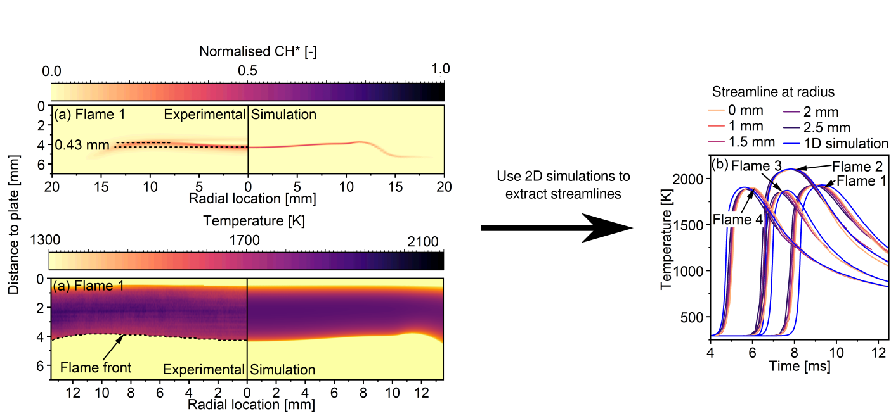

New experimental 2D measurements are reported to characterise the flame location, shape and temperature of laminar premixed ethylene jet-wall stagnation flames when the equivalence ratio, exit gas velocity and burner-plate separation distance are varied. Bandpass-filtered optical measurements of the CH* chemiluminescence were used to provide information about the shape and location of the flames. Thin filament pyrometry (TFP) using a 14 μm diameter SiC filament was used to make line measurements of the temperature to reconstruct the full 2D temperature field for the first time in premixed, jet-wall stagnation flames. The comparison of CH* measurements with (intrusive) and without (non-intrusive) the presence of the SiC filament showed that the filament resulted in minimal disturbance of the flame when the filament was placed downstream of the flame front. However, the flame was observed to attach to the filament, resulting in more significant disturbance, when the filament was placed upstream of the flame front. The flames were simulated using both 1D and 2D models. The 2D simulations were used to provide estimates of the velocity, kinematic viscosity and thermal conductivity required to obtain the gas temperature from the TFP data. The 1D simulations showed excellent agreement with the experimentally observed centreline quantities but required the strain boundary condition to be fitted in order to match the experimentally observed flame location. The 2D simulations showed excellent agreement without the need for any fitting and correctly predicted the flame shape, location and temperature as the experimental conditions were varied. A comparison of the set of simulated temperature-residence time distributions showed relatively uniform distributions within each flame. However, the most uniform set of distributions did not correlate with the flattest flame. 

The work is published in the Proceedings of the Combustion Institute and can be found here: [doi:10.1016/j.proci.2020.06.106](https://doi.org/10.1016/j.proci.2020.06.106), [open-access preprint](https://como.ceb.cam.ac.uk/preprints/250/). A copy of the slides can be found [here](./2021-01-27-PROCI.pdf).