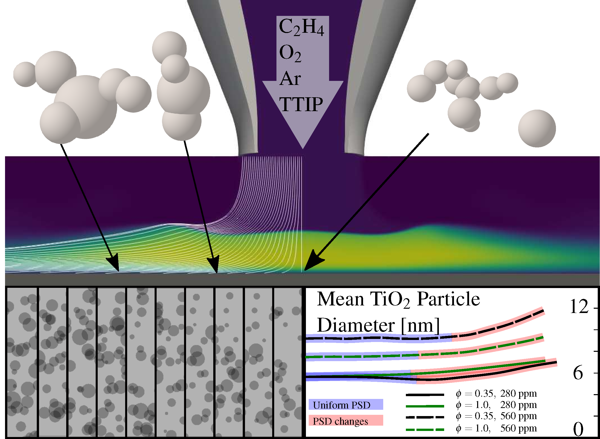

The formation of titanium dioxide (TiO2) nanoparticles from titanium tetraisopropoxide (TTIP) in premixed, jet-wall stagnation flames was simulated to investigate the variation of the particle properties as a function of deposition radius.
Two different TTIP loadings (280 and 560 ppm) were studied in two flames: a lean flame (equivalence ratio, &straightphi;=0.35) and a stoichiometric flame (&straightphi;=1.0).
First, the growth of particles was described using a spherical particle model that was fully coupled to the conservation equations of chemically reacting flow and solved in 2D using the finite volume method.
Second, particle trajectories were extracted from the 2D simulations and post-processed using a hybrid particle-number/detailed particle model solved using a stochastic numerical method.
In the 2D simulations, the particles were predicted to have mean diameters in the range of 3 to 10 nm, which is consistent with, but slightly less than experimental values observed in the literature. 
Off-centreline particle trajectories experienced longer residence times at higher temperatures downstream of the flame front.
Two particle size distribution (PSD) shapes were observed.
In the lean flame, a bimodal PSD was observed due to the high rates of inception and surface growth.
In contrast, the stoichiometric flame was dominated by coagulation and the particles quickly attained a self-preserving size distribution. 
The PSDs were found to be different beyond a deposition radius of approximately one and a half times the nozzle radius due to a small degree of aggregation; this may impact the synthesis of nanoparticles using jet-wall stagnation flames for novel applications.

The work is available as an [open-access preprint](https://como.ceb.cam.ac.uk/preprints/272/). A copy of the slides can be found [here](../files/2021-06-25-CPM.pdf).